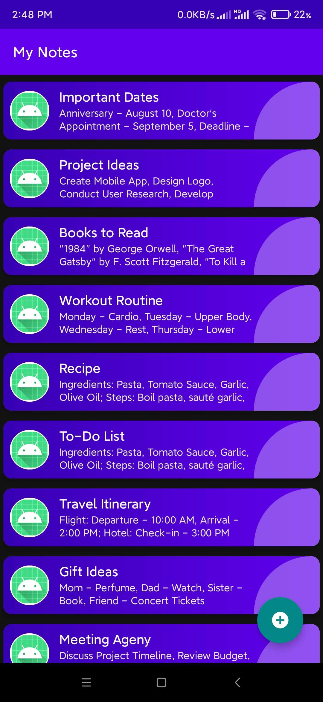
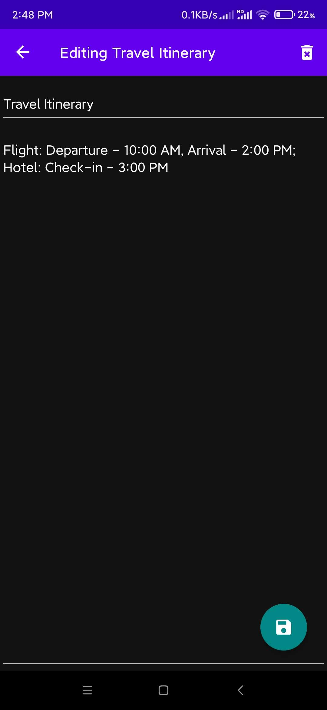
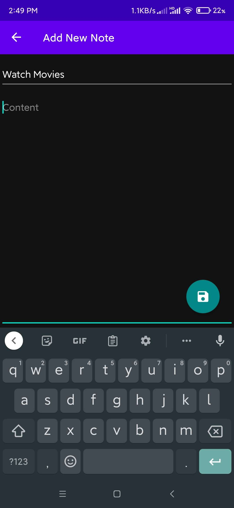

# Clean Android

The application has been designed following Clean Architecture, SOLID Principles, and modern Android best practices. It uses technologies such as Room, Kotlin Coroutines, LiveData, DiffUtil, View Binding, and the Android Navigation Component.

## Clean Architecture

The primary goal of Clean Architecture is separation of concerns, which means that each part of the application should be independent of others. In this project, Clean Architecture is demonstrated through the layered structuring of the codebase into Core, Domain and Presentation (or Framework) layers.

### Core Layer

Core Layer contains pure Kotlin code and doesn't know anything about Android or any other third-party frameworks. This is an important principle of Clean Architecture, making it more testable and versatile.

```kotlin
data class Note(
    val title: String,
    val content: String,
    // ...
)

interface INoteDataSource {
    suspend fun insert(note: Note): Boolean
    fun get(noteId: Long): Flow<Note?>
    // ...
}

class NoteRepository(private val dataSource: INoteDataSource) {
    suspend fun insert(note: Note): Boolean {
        dataSource.insert(note)
        return true
    }

    fun get(noteId: Long): Flow<Note?> {
        return dataSource.get(noteId)
    }
    // ...
}
```

The data class `Note` represents a note in the application. The `INoteDataSource` interface and `NoteRepository` class create an abstraction for managing notes. The repository uses the data source interface to perform CRUD operations. This helps to adhere to the **Dependency Inversion Principle**, as the higher-level module `NoteRepository` does not depend on the lower-level module, but they depend on abstractions.

### Domain Layer

The use cases (`InsertNote`, `GetNote`, `GetAllNotes`, `DeleteNote`) encapsulate the business rules of the application. They use the `NoteRepository` to perform operations. This follows the **Single Responsibility Principle** because each use case has only one job.

```kotlin
class InsertNote(private val noteRepository: NoteRepository) {
    suspend operator fun invoke(note: Note) = noteRepository.insert(note)
}

class GetNote(private val noteRepository: NoteRepository) {
    operator fun invoke(noteId: Long) = noteRepository.get(noteId)
}
// ...
```

### Presentation Layer

In this layer, Android and UI-related code reside. The ViewModel communicates with the use cases to perform operations. This layer doesn't have any business logic.

#### Framework

The ViewModel `NoteViewModel` encapsulates data for the UI. It communicates with the `NoteRepository` to perform operations. The `DetailsFragment` and `ListFragment` classes represent the user interface of the application. They are responsible for handling user interactions and updating the screen based on data changes. This adheres to the **Separation of Concerns Principle**, as the ViewModel is responsible for the data operations, and the UI components are responsible for displaying the data and handling user interactions.

```kotlin
class NoteViewModel(application: Application) : AndroidViewModel(application) {
    //...
    private val _note = MutableStateFlow<Note?>(null)
    val note: StateFlow<Note?>
        get() = _note

    fun getNote(noteId: Long) {
        viewModelScope.launch {
          useCases.getNote(noteId).collect {note ->
              _note.value = note
          }
        }
    }
    //...
}
```

#### UI

Represents a UI controller in the Presentation layer:

```kotlin
class DetailsFragment : Fragment(), INoteClick {
    //...
    private fun observeViewModels() {
        viewLifecycleOwner.lifecycleScope.launch {
            repeatOnLifecycle(Lifecycle.State.CREATED) {
                viewModel.note.collect { note ->
                    // handle the note...
                }
            }
        }
    }
    //...
}
```

## Android Practices

### Room Persistence

Room is a persistence library that provides an abstraction layer over SQLite to allow for more robust database access while harnessing the full power of SQLite. The library helps create a cache of the app's data on a device that's running the app.

```kotlin
@Dao
interface NoteDao {
    @Insert(onConflict = OnConflictStrategy.REPLACE)
    suspend fun insertEntity(noteEntity: NoteEntity)

    @Query("SELECT * FROM note WHERE id=:noteId")
    fun getEntity(noteId: Long): Flow<NoteEntity?>
    // ...
}
``````

The project uses Room indirectly via the `INoteDataSource` interface, which would have a Room implementation in an actual application.

### Kotlin Coroutines and Flow

The project uses Kotlin Coroutines, a concurrency design pattern that can be used on Android to simplify code that executes asynchronously. Coroutines were added to Kotlin in version 1.3 and are based on established concepts from other languages.

On Android, callbacks can be executed even if the app has more important work to do, which can lead to problems such as slow UI or ANR dialogs. By using coroutines, code can be written that behaves as though it's synchronous while running asynchronously.

Kotlin Flow is a cold asynchronous data stream that sequentially emits values and completes normally or with an exception.

```kotlin
// Interface Data Source
fun get(noteId: Long): Flow<Note?>

// View Model
private val _note = MutableStateFlow<Note?>(null)
val note: StateFlow<Note?>
    get() = _note

fun getNote(noteId: Long) {
    viewModelScope.launch {
        useCases.getNote(noteId).collect {note ->
            _note.value = note
        }
    }
}

// UI
private fun observeViewModels() {
    viewLifecycleOwner.lifecycleScope.launch {
        repeatOnLifecycle(Lifecycle.State.CREATED) {
            // ...
        }
    }
}

```

The project leverages Kotlin Flow, Room, and coroutines for efficient, real-time, and lifecycle-aware database operations and UI updates.

1. **Real-time updates:** The DAO interfaces return a `Flow`, emitting updates with every database change, ensuring the UI is always up-to-date.

2. **Asynchronous and non-blocking:** Database operations are performed asynchronously using Kotlin Flow and coroutines, keeping the UI thread unblocked and the app responsive.

3. **Backpressure handling:** Kotlin Flow automatically handles backpressure, ensuring the app remains responsive even if data is emitted faster than the UI can consume.

4. **Lifecycle-aware:** Collecting the `Flow` within a `repeatOnLifecycle` block in the UI class makes data collection lifecycle-aware, preventing updates to non-active UI components.

5. **Efficient resource usage:** `Flow` is cold and doesn't run queries until there's an active observer, promoting efficient resource usage.

### View Binding

View binding is a feature that allows for more easily writing code that interacts with views. It replaces `findViewById`.

In the project, View Binding is used to interact with views in a safe and concise way.

```kotlin
_binding = FragmentDetailsBinding.inflate(inflater, container, false)
val view = binding.root
```

### Android Navigation

The Navigation component is a library that helps implement navigation, from simple button clicks to more complex patterns, such as app bars and the navigation drawer.

In the project, the Navigation Component is used to navigate between fragments.

```kotlin
val action = ListFragmentDirections
    .actionListFragmentToDetailsFragment("Add New Note")
navController.navigate(action)
```

<p align="middle">
    
    
    
</p>
